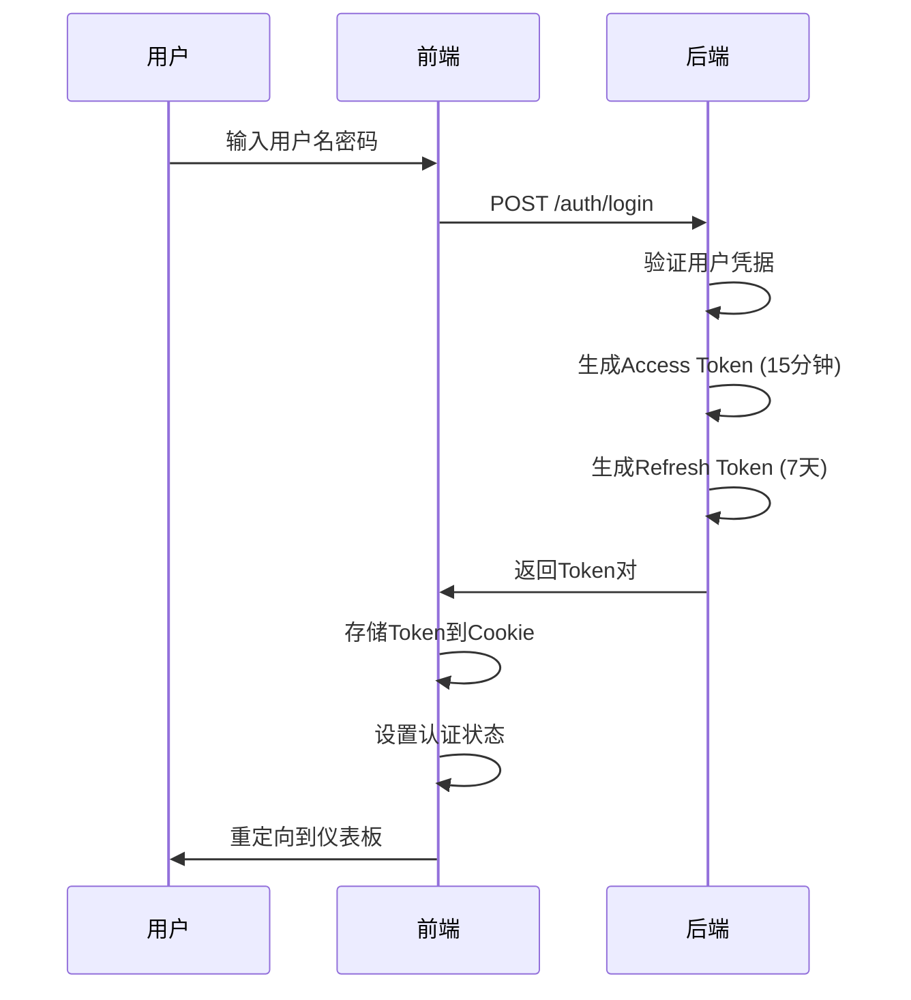
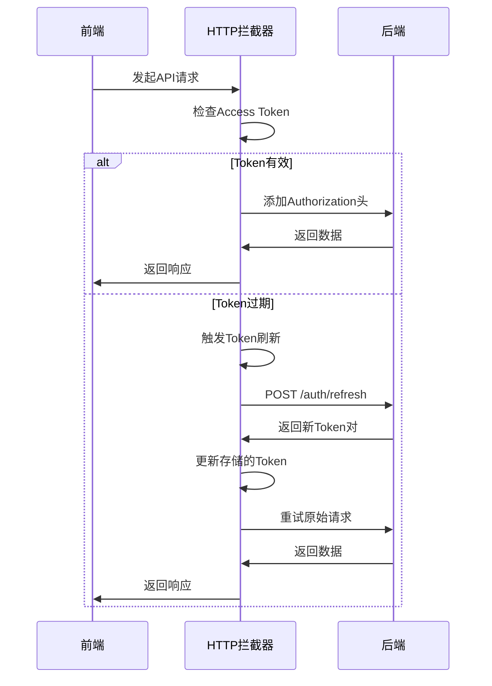
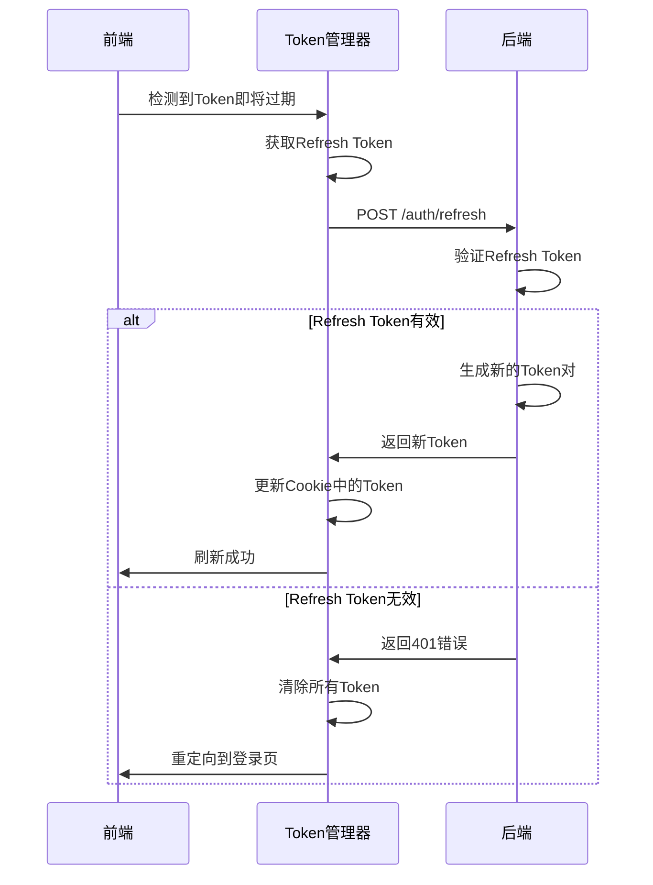

# 双Token认证机制完整指南

## 概述

本文档详细说明了 Exam Pass Mono 项目中实现的双Token认证机制，包括Access Token和Refresh Token的设计原理、实现细节、安全考虑和最佳实践。

## 1. 双Token机制原理

### 1.1 为什么需要两个Token？

#### 安全性考虑
- **Access Token短期有效**：减少Token被盗用的风险窗口
- **Refresh Token长期有效**：避免用户频繁登录
- **职责分离**：不同Token承担不同的安全职责
- **撤销控制**：可以独立撤销不同类型的Token

#### 用户体验优化
- **无感知刷新**：用户无需重新登录即可延续会话
- **持久化会话**：支持"记住我"功能
- **优雅降级**：Token过期时的平滑处理

### 1.2 Token配置对比

| 特性 | Access Token | Refresh Token |
|------|-------------|---------------|
| **有效期** | 15分钟 | 7天 |
| **用途** | API访问认证 | 刷新Access Token |
| **存储位置** | Cookie | Cookie |
| **安全级别** | 高频使用，短期有效 | 低频使用，长期有效 |
| **撤销策略** | 自动过期 | 主动撤销 |

## 2. 后端实现

### 2.1 Token生成机制

```typescript
// apps/api/src/auth/auth.service.ts

/**
 * 生成访问令牌和刷新令牌
 */
private async generateTokens(user: User): Promise<TokenResponse> {
  const payload = {
    sub: user.id,
    email: user.email,
    role: user.role,
  };

  const [accessToken, refreshToken] = await Promise.all([
    // Access Token: 15分钟有效期
    this.jwtService.signAsync(payload, {
      secret: this.configService.get('JWT_SECRET'),
      expiresIn: '15m',
    }),
    // Refresh Token: 7天有效期
    this.jwtService.signAsync(payload, {
      secret: this.configService.get('JWT_SECRET'),
      expiresIn: '7d',
    }),
  ]);

  return {
    accessToken,
    refreshToken,
  };
}
```

### 2.2 Token刷新机制

```typescript
/**
 * 刷新访问令牌
 */
async refreshToken(refreshTokenDto: RefreshTokenDto): Promise<TokenResponse> {
  const { refreshToken } = refreshTokenDto;

  try {
    // 验证Refresh Token
    const payload = this.jwtService.verify(refreshToken, {
      secret: this.configService.get('JWT_SECRET'),
    });

    // 根据用户ID获取最新用户信息
    const user = await this.usersService.findById(payload.sub);
    if (!user) {
      throw new UnauthorizedException('User not found');
    }

    // 生成新的Token对
    return this.generateTokens(user);
  } catch (error) {
    throw new UnauthorizedException('Invalid refresh token');
  }
}
```

### 2.3 JWT策略配置

```typescript
// apps/api/src/auth/strategies/jwt.strategy.ts

@Injectable()
export class JwtStrategy extends PassportStrategy(Strategy) {
  constructor(private configService: ConfigService) {
    super({
      jwtFromRequest: ExtractJwt.fromAuthHeaderAsBearerToken(),
      ignoreExpiration: false,
      secretOrKey: configService.get('JWT_SECRET'),
    });
  }

  async validate(payload: JwtPayload) {
    return {
      id: payload.sub,
      email: payload.email,
      role: payload.role,
    };
  }
}
```

## 3. 前端实现

### 3.1 Token管理器

```typescript
// apps/web/src/utils/token-manager.ts

/**
 * 统一的Token管理工具
 * 使用Cookie替代localStorage，支持SSR
 */
export class TokenManager {
  // Token配置
  private static readonly TOKEN_CONFIG = {
    ACCESS_TOKEN: {
      name: 'accessToken',
      maxAge: 15 * 60, // 15分钟
      secure: process.env.NODE_ENV === 'production',
    },
    REFRESH_TOKEN: {
      name: 'refreshToken',
      maxAge: 7 * 24 * 60 * 60, // 7天
      secure: process.env.NODE_ENV === 'production',
    }
  };

  /**
   * 设置完整的认证数据
   */
  static setAuthData(tokens: TokenData): void {
    this.setAccessToken(tokens.accessToken);
    this.setRefreshToken(tokens.refreshToken);
  }

  /**
   * 获取认证数据
   */
  static getAuthData(): {
    accessToken: string | null;
    refreshToken: string | null;
  } {
    return {
      accessToken: this.getAccessToken(),
      refreshToken: this.getRefreshToken(),
    };
  }

  /**
   * 验证认证数据完整性
   */
  static validateAuthData(): boolean {
    const { accessToken, refreshToken } = this.getAuthData();
    return !!(accessToken && refreshToken);
  }
}
```

### 3.2 HTTP拦截器

```typescript
// apps/web/src/utils/http-interceptor.ts

/**
 * 智能Token刷新机制
 */
class TokenRefreshManager {
  private static refreshPromise: Promise<boolean> | null = null;
  private static isRefreshing = false;
  private static failedQueue: Array<{
    resolve: (value: boolean) => void;
    reject: (error: any) => void;
  }> = [];

  /**
   * 刷新Token（防止并发）
   */
  static async refreshToken(): Promise<boolean> {
    // 如果已经在刷新中，返回现有的Promise
    if (this.refreshPromise) {
      return this.refreshPromise;
    }

    this.isRefreshing = true;
    this.refreshPromise = this.performRefresh();

    try {
      const result = await this.refreshPromise;
      this.processQueue(null, result);
      return result;
    } catch (error) {
      this.processQueue(error, false);
      throw error;
    } finally {
      this.isRefreshing = false;
      this.refreshPromise = null;
    }
  }

  private static async performRefresh(): Promise<boolean> {
    const refreshToken = TokenManager.getRefreshToken();
    
    if (!refreshToken) {
      throw new Error('No refresh token available');
    }

    try {
      const response = await authControllerRefreshToken({
        refreshToken
      });

      TokenManager.setAuthData({
        accessToken: response.accessToken,
        refreshToken: response.refreshToken,
      });

      return true;
    } catch (error) {
      TokenManager.clearAll();
      throw error;
    }
  }
}
```

### 3.3 认证上下文

```typescript
// apps/web/src/contexts/auth-context.tsx

export function AuthProvider({ children }: { children: React.ReactNode }) {
  const [authStatus, setAuthStatus] = useState<AuthStatus>(AuthStatus.UNAUTHENTICATED);
  const [user, setUser] = useState<UserProfileDto | null>(null);

  // 登录函数
  const login = useCallback((tokens: AuthTokens, userData: UserProfileDto) => {
    try {
      // 验证Token有效性
      const validation = validateJwtToken(tokens.accessToken);
      
      if (!validation.isValid) {
        const newStatus = validation.isExpired 
          ? AuthStatus.TOKEN_EXPIRED 
          : AuthStatus.AUTH_FAILED;
        setAuthStatus(newStatus);
        return;
      }

      setUser(userData);
      setAuthStatus(AuthStatus.AUTHENTICATED);
      TokenManager.setAuthData(tokens);
    } catch (error) {
      setAuthStatus(AuthStatus.AUTH_FAILED);
    }
  }, []);

  // 初始化时验证Token
  useEffect(() => {
    const accessToken = TokenManager.getAccessToken();
    
    if (!accessToken) {
      setAuthStatus(AuthStatus.UNAUTHENTICATED);
      return;
    }

    const validation = validateJwtToken(accessToken);
    
    if (validation.isValid) {
      setAuthStatus(AuthStatus.AUTHENTICATING);
      // 触发用户信息获取
    } else {
      setAuthStatus(AuthStatus.TOKEN_EXPIRED);
    }
  }, []);
}
```

### 3.4 Middleware保护

```typescript
// apps/web/src/middleware.ts

/**
 * 检查用户是否已认证
 */
function isAuthenticated(request: NextRequest): boolean {
  const accessToken = request.cookies.get('accessToken')?.value;

  if (!accessToken) {
    return false;
  }

  try {
    // 解码JWT Token
    const decoded = jwtDecode<JwtPayload>(accessToken);

    // 检查Token是否过期
    const currentTime = Math.floor(Date.now() / 1000);
    if (decoded.exp && decoded.exp < currentTime) {
      return false;
    }

    return true;
  } catch (error) {
    // Token格式无效或解码失败
    return false;
  }
}

export function middleware(request: NextRequest) {
  const { pathname } = request.nextUrl;
  const userIsAuthenticated = isAuthenticated(request);

  // 受保护的路径：未认证用户重定向到登录页
  if (matchesPath(pathname, protectedPaths) && !userIsAuthenticated) {
    const loginUrl = new URL('/login', request.url);
    loginUrl.searchParams.set('returnUrl', pathname);
    return NextResponse.redirect(loginUrl);
  }

  // 访客路径：已认证用户重定向到仪表板
  if (matchesPath(pathname, guestPaths) && userIsAuthenticated) {
    return NextResponse.redirect(new URL('/dashboard', request.url));
  }

  return NextResponse.next();
}
```

## 4. 双Token工作流程

### 4.1 初始登录流程



### 4.2 API访问流程



### 4.3 Token刷新流程



## 5. 安全考虑

### 5.1 Token安全措施

#### Cookie配置
```typescript
const cookieOptions = {
  httpOnly: false,    // 前端需要读取（考虑设置为true增强安全性）
  secure: true,       // 仅HTTPS传输
  sameSite: 'strict', // 防止CSRF攻击
  path: '/',          // 全站可用
};
```

#### JWT验证
- **格式验证**：确保Token格式正确
- **过期检查**：验证Token未过期
- **签名验证**：后端验证Token签名
- **负载验证**：检查Token负载完整性

### 5.2 攻击防护

#### XSS防护
- 使用HttpOnly Cookie（考虑中）
- 内容安全策略（CSP）
- 输入验证和输出编码

#### CSRF防护
- SameSite Cookie属性
- CSRF Token（可选）
- Origin验证

#### Token泄露防护
- 短期Access Token
- 定期轮换Refresh Token
- 异常检测和自动撤销

## 6. 性能优化

### 6.1 Token刷新优化

#### 预防性刷新
```typescript
/**
 * 检查是否应该刷新Token
 * @param token - Access Token
 * @param thresholdMinutes - 提前刷新的时间阈值（分钟）
 */
export function shouldRefreshToken(
  token: string, 
  thresholdMinutes: number = 5
): boolean {
  const remainingTime = getTokenRemainingTime(token);
  return remainingTime <= thresholdMinutes * 60;
}
```

#### 并发控制
- 防止多个并发刷新请求
- 请求队列管理
- 失败重试机制

### 6.2 缓存策略

#### 用户信息缓存
```typescript
const { data: profileData } = useAuthControllerGetProfile({
  query: {
    staleTime: 5 * 60 * 1000, // 5分钟内不重新获取
    cacheTime: 10 * 60 * 1000, // 10分钟缓存时间
  },
});
```

## 7. 错误处理

### 7.1 错误类型分类

```typescript
export enum AuthErrorType {
  INVALID_CREDENTIALS = 'INVALID_CREDENTIALS',
  TOKEN_EXPIRED = 'TOKEN_EXPIRED',
  TOKEN_INVALID = 'TOKEN_INVALID',
  REFRESH_FAILED = 'REFRESH_FAILED',
  NETWORK_ERROR = 'NETWORK_ERROR',
  UNKNOWN_ERROR = 'UNKNOWN_ERROR',
}
```

### 7.2 错误处理策略

#### 自动重试
- Token过期：自动刷新后重试
- 网络错误：指数退避重试
- 服务器错误：有限次数重试

#### 用户提示
- 友好的错误消息
- 操作指导建议
- 恢复操作选项

## 8. 监控和日志

### 8.1 关键指标监控

- **Token刷新频率**：监控刷新请求的频率和成功率
- **认证失败率**：跟踪认证失败的原因和频率
- **会话持续时间**：分析用户会话的平均持续时间
- **安全事件**：监控异常的认证行为

### 8.2 日志记录

```typescript
// 认证事件日志
const authLogger = {
  loginSuccess: (userId: string) => {
    console.log(`[AUTH] Login successful for user: ${userId}`);
  },
  tokenRefresh: (userId: string) => {
    console.log(`[AUTH] Token refreshed for user: ${userId}`);
  },
  authFailure: (reason: string, context?: any) => {
    console.warn(`[AUTH] Authentication failed: ${reason}`, context);
  },
};
```

## 9. 测试策略

### 9.1 单元测试

```typescript
// Token管理器测试
describe('TokenManager', () => {
  it('should store and retrieve tokens correctly', () => {
    const tokens = {
      accessToken: 'test-access-token',
      refreshToken: 'test-refresh-token',
    };
    
    TokenManager.setAuthData(tokens);
    
    expect(TokenManager.getAccessToken()).toBe(tokens.accessToken);
    expect(TokenManager.getRefreshToken()).toBe(tokens.refreshToken);
  });
  
  it('should validate auth data correctly', () => {
    TokenManager.clearAll();
    expect(TokenManager.validateAuthData()).toBe(false);
    
    TokenManager.setAuthData({
      accessToken: 'test-token',
      refreshToken: 'test-refresh',
    });
    expect(TokenManager.validateAuthData()).toBe(true);
  });
});
```

### 9.2 集成测试

```typescript
// 认证流程集成测试
describe('Authentication Flow', () => {
  it('should handle complete login flow', async () => {
    // 模拟登录
    const loginResponse = await authControllerLogin({
      email: 'test@example.com',
      password: 'password123',
    });
    
    expect(loginResponse.accessToken).toBeDefined();
    expect(loginResponse.refreshToken).toBeDefined();
    
    // 验证Token存储
    expect(TokenManager.getAccessToken()).toBe(loginResponse.accessToken);
    
    // 测试API调用
    const profileResponse = await authControllerGetProfile();
    expect(profileResponse.email).toBe('test@example.com');
  });
});
```

### 9.3 端到端测试

```typescript
// E2E认证测试
describe('Authentication E2E', () => {
  it('should maintain session across page refreshes', async () => {
    // 登录
    await page.goto('/login');
    await page.fill('[data-testid=email]', 'test@example.com');
    await page.fill('[data-testid=password]', 'password123');
    await page.click('[data-testid=login-button]');
    
    // 验证重定向到仪表板
    expect(page.url()).toContain('/dashboard');
    
    // 刷新页面
    await page.reload();
    
    // 验证仍然在仪表板（未被重定向到登录页）
    expect(page.url()).toContain('/dashboard');
  });
});
```

## 10. 最佳实践

### 10.1 开发建议

1. **Token生命周期管理**
   - 合理设置Token过期时间
   - 实现预防性Token刷新
   - 处理Token刷新失败场景

2. **安全性考虑**
   - 使用HTTPS传输
   - 实现适当的CORS策略
   - 定期轮换密钥

3. **用户体验优化**
   - 无感知的Token刷新
   - 优雅的错误处理
   - 合理的加载状态

### 10.2 部署注意事项

1. **环境变量配置**
   ```bash
   # JWT密钥（生产环境必须使用强密钥）
   JWT_SECRET=your-super-secret-key
   
   # Token过期时间
   JWT_EXPIRES_IN=15m
   JWT_REFRESH_EXPIRES_IN=7d
   ```

2. **Cookie配置**
   - 生产环境启用Secure标志
   - 配置适当的SameSite策略
   - 考虑使用HttpOnly（需要调整前端实现）

3. **监控和告警**
   - 设置认证失败率告警
   - 监控Token刷新频率
   - 跟踪安全相关事件

## 11. 故障排除

### 11.1 常见问题

#### Token刷新失败
**症状**：用户频繁被重定向到登录页
**原因**：Refresh Token过期或无效
**解决**：检查Token存储和过期时间配置

#### 认证状态不一致
**症状**：页面显示未认证但Cookie中有Token
**原因**：Token格式错误或解码失败
**解决**：验证JWT格式和密钥配置

#### 并发刷新问题
**症状**：多个Token刷新请求导致冲突
**原因**：缺少并发控制机制
**解决**：实现Token刷新队列管理

### 11.2 调试工具

```typescript
// 认证状态调试工具
const authDebugger = {
  logTokenInfo: () => {
    const accessToken = TokenManager.getAccessToken();
    const refreshToken = TokenManager.getRefreshToken();
    
    console.log('=== Auth Debug Info ===');
    console.log('Access Token:', accessToken ? 'Present' : 'Missing');
    console.log('Refresh Token:', refreshToken ? 'Present' : 'Missing');
    
    if (accessToken) {
      const validation = validateJwtToken(accessToken);
      console.log('Token Valid:', validation.isValid);
      console.log('Token Expired:', validation.isExpired);
      if (validation.payload) {
        console.log('Token Expires At:', new Date(validation.payload.exp! * 1000));
      }
    }
  },
};
```

## 12. 总结

双Token认证机制为 Exam Pass Mono 项目提供了：

### 12.1 核心优势

1. **安全性**：短期Access Token + 长期Refresh Token的组合
2. **用户体验**：无感知的Token刷新和会话延续
3. **性能**：智能的缓存和刷新策略
4. **可维护性**：清晰的架构和职责分离
5. **扩展性**：支持未来的安全需求扩展

### 12.2 关键设计决策

1. **Cookie存储**：支持SSR和更好的安全性
2. **Middleware保护**：服务端路由保护避免客户端闪烁
3. **智能刷新**：预防性刷新和并发控制
4. **错误处理**：完善的错误分类和恢复机制

### 12.3 持续改进方向

1. **安全增强**：考虑实现Token轮换和设备绑定
2. **性能优化**：进一步优化Token验证和刷新逻辑
3. **监控完善**：增加更详细的认证行为分析
4. **用户体验**：实现更智能的会话管理

这个双Token认证机制为项目提供了坚实的安全基础，同时保持了良好的用户体验和系统性能。通过持续的监控和优化，可以确保认证系统的可靠性和安全性。