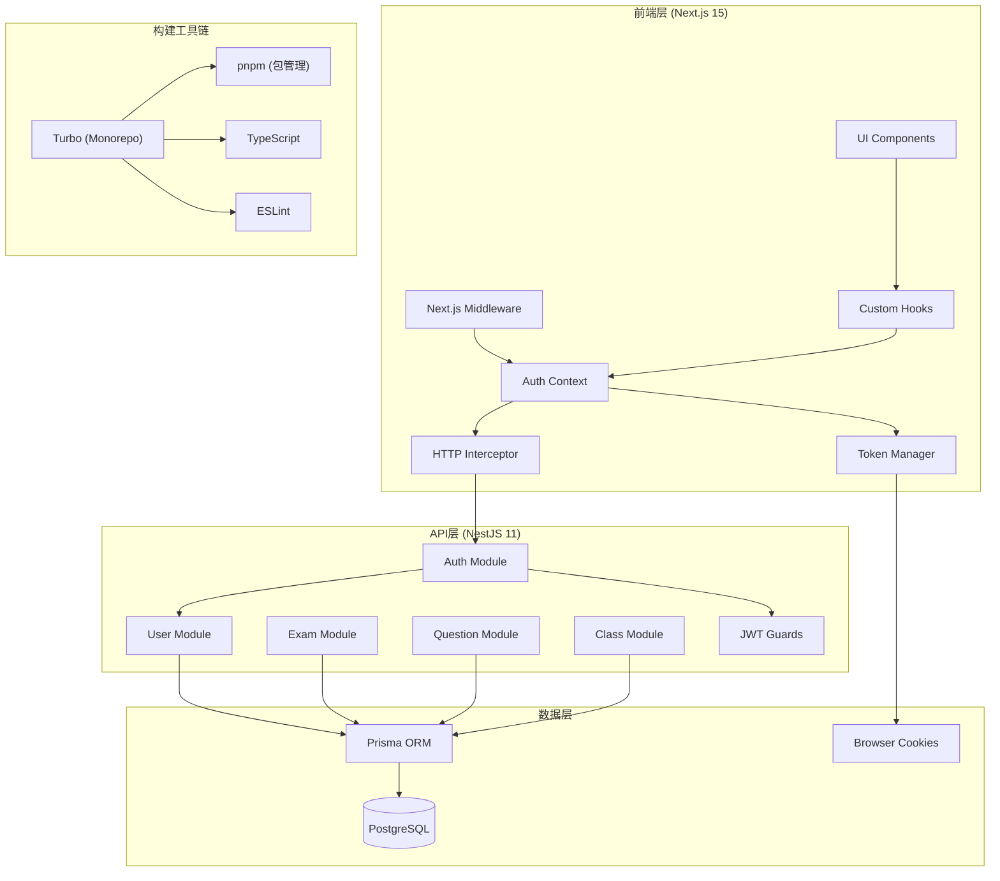

# Exam Pass Mono 项目技术架构文档

## 项目概述

Exam Pass Mono 是一个基于 Monorepo 架构的现代化考试通过系统，采用前后端分离的设计模式，为学生、教师和管理员提供完整的在线考试解决方案。项目使用 TypeScript 全栈开发，确保类型安全和代码质量。

### 核心功能模块

- **用户管理系统**: 支持学生、教师、管理员三种角色
- **班级管理**: 班级创建、成员管理、权限控制
- **题库系统**: 题目创建、分类、标签管理
- **考试系统**: 考试创建、配置、实时监控
- **答题系统**: 在线答题、自动评分、结果统计
- **错题本**: 错题收集、复习提醒
- **收藏夹**: 重点题目收藏管理
- **数据分析**: 成绩统计、学习报告

## 技术架构总览

### 架构图



## 技术栈详解

### 前端技术栈

#### 核心框架
- **Next.js 15.4.6**: React 全栈框架，支持 SSR/SSG
- **React 19.1.0**: 最新版本 React，支持并发特性
- **TypeScript 5.x**: 类型安全的 JavaScript 超集

#### UI 和样式
- **Tailwind CSS 4.x**: 原子化 CSS 框架
- **Shadcn/ui**: 基于 Radix UI 的组件库
- **Lucide React**: 现代化图标库
- **Class Variance Authority**: 组件变体管理

#### 状态管理和数据获取
- **@tanstack/react-query 5.62.7**: 服务端状态管理
- **React Context**: 全局状态管理
- **Axios 1.11.0**: HTTP 客户端

#### 认证相关
- **jwt-decode 4.0.0**: JWT 令牌解码
- **Cookie**: 令牌存储（支持 SSR）

#### 开发工具
- **Orval 7.11.2**: API 客户端代码生成
- **ESLint 9.x**: 代码质量检查
- **PostCSS**: CSS 后处理器

### 后端技术栈

#### 核心框架
- **NestJS 11.0.1**: 企业级 Node.js 框架
- **Node.js 18+**: JavaScript 运行时
- **TypeScript 5.x**: 类型安全开发

#### 认证和安全
- **@nestjs/jwt 11.0.0**: JWT 令牌处理
- **@nestjs/passport 11.0.5**: 认证策略框架
- **passport-jwt 4.0.1**: JWT 认证策略
- **bcrypt 6.0.0**: 密码哈希加密

#### 数据库和 ORM
- **Prisma 6.14.0**: 现代化 ORM
- **PostgreSQL**: 关系型数据库
- **@prisma/client**: Prisma 客户端

#### 数据验证和文档
- **Zod 4.0.17**: 运行时类型验证
- **nestjs-zod 5.0.0**: NestJS Zod 集成
- **@nestjs/swagger 11.2.0**: API 文档生成
- **class-validator 0.14.2**: 类验证器
- **class-transformer 0.5.1**: 数据转换

### 构建和开发工具

#### Monorepo 管理
- **Turbo 2.5.6**: 高性能构建系统
- **pnpm 10.14.0**: 快速、节省磁盘空间的包管理器
- **pnpm workspace**: 工作区管理

#### 代码质量
- **ESLint**: 代码规范检查
- **Prettier**: 代码格式化
- **TypeScript**: 类型检查

## 核心架构设计

### 1. Monorepo 架构

```
exam-pass-mono/
├── apps/
│   ├── api/          # NestJS 后端应用
│   └── web/          # Next.js 前端应用
├── packages/         # 共享包（未来扩展）
├── docs/            # 项目文档
├── .trae/           # Trae AI 配置
└── turbo/           # Turbo 生成器模板
```

**优势**:
- 统一的依赖管理和版本控制
- 代码共享和重用
- 统一的构建和部署流程
- 更好的开发体验和协作效率

### 2. 前端架构设计

#### 2.1 Next.js App Router 架构

```
apps/web/src/
├── app/              # Next.js App Router
│   ├── layout.tsx    # 根布局
│   ├── page.tsx      # 首页
│   └── (routes)/     # 路由组织
├── components/       # 可复用组件
│   └── ui/          # 基础 UI 组件
├── contexts/         # React Context
├── hooks/           # 自定义 Hooks
├── lib/             # 工具库
├── services/        # API 服务（自动生成）
├── types/           # 类型定义
├── utils/           # 工具函数
└── middleware.ts    # Next.js 中间件
```

#### 2.2 认证架构设计

**多层防护策略**:
1. **Next.js Middleware**: 服务端路由保护，避免客户端闪烁
2. **React Context**: 全局认证状态管理
3. **HTTP Interceptor**: 自动令牌刷新和错误处理
4. **Custom Hooks**: 组件级认证控制

**核心组件**:
- `middleware.ts`: 路由级别的认证检查
- `auth-context.tsx`: 全局认证状态
- `token-manager.ts`: 统一令牌管理
- `http-interceptor.ts`: 请求拦截和令牌刷新
- `useAuthGuard.ts`: 组件级认证 Hook

### 3. 后端架构设计

#### 3.1 NestJS 模块化架构

```
apps/api/src/
├── app.module.ts     # 根模块
├── main.ts          # 应用入口
├── auth/            # 认证模块
│   ├── auth.module.ts
│   ├── auth.service.ts
│   ├── auth.controller.ts
│   ├── dto/         # 数据传输对象
│   ├── guards/      # 认证守卫
│   └── strategies/  # 认证策略
├── users/           # 用户模块
├── exams/           # 考试模块
├── questions/       # 题目模块
├── classes/         # 班级模块
├── common/          # 公共模块
│   └── utils/       # 工具函数
└── prisma/          # 数据库模块
```

#### 3.2 数据库设计

**核心实体模型**:
- `User`: 用户信息（学生、教师、管理员）
- `Class`: 班级信息
- `ClassMember`: 班级成员关系
- `Question`: 题目信息
- `Exam`: 考试配置
- `ExamAttempt`: 考试记录
- `Answer`: 答题记录
- `WrongQuestion`: 错题记录
- `FavoriteQuestion`: 收藏题目

**关系设计**:
- 用户与班级：多对多关系（通过 ClassMember）
- 用户与考试：一对多关系（ExamAttempt）
- 考试与题目：多对多关系（ExamQuestion）
- 用户与错题/收藏：一对多关系

### 4. API 设计规范

#### 4.1 RESTful API 设计

```typescript
// 用户相关 API
GET    /api/users          # 获取用户列表
GET    /api/users/:id      # 获取用户详情
POST   /api/users          # 创建用户
PUT    /api/users/:id      # 更新用户
DELETE /api/users/:id      # 删除用户

// 认证相关 API
POST   /api/auth/login     # 用户登录
POST   /api/auth/refresh   # 刷新令牌
POST   /api/auth/logout    # 用户登出
GET    /api/auth/profile   # 获取用户资料
```

#### 4.2 DTO 和验证规范

**使用 Zod 进行数据验证**:
```typescript
// Schema 定义
export const CreateUserSchema = z.object({
  email: emailString().describe('用户邮箱'),
  password: passwordString().describe('用户密码'),
  name: z.string().min(1).describe('用户姓名'),
  role: z.enum(['STUDENT', 'TEACHER', 'ADMIN']).describe('用户角色'),
});

// DTO 类生成
export class CreateUserDto extends createZodDto(CreateUserSchema) {}

// 类型导出
export type CreateUser = z.infer<typeof CreateUserSchema>;
```

#### 4.3 Swagger 文档规范

```typescript
@ApiTags('users')
@Controller('users')
export class UsersController {
  @Post()
  @ApiOperation({ summary: '创建新用户' })
  @ApiResponse({
    status: 201,
    description: '用户创建成功',
    type: UserDto,
  })
  @ApiResponse({ status: 400, description: '请求参数错误' })
  create(@Body() createUserDto: CreateUserDto): Promise<User> {
    return this.usersService.create(createUserDto);
  }
}
```

## 安全架构设计

### 1. 认证安全

#### 双令牌机制
- **Access Token**: 15分钟有效期，用于 API 访问
- **Refresh Token**: 7天有效期，用于刷新 Access Token
- **自动刷新**: HTTP 拦截器自动处理令牌刷新

#### JWT 安全配置
```typescript
const jwtConfig = {
  secret: process.env.JWT_SECRET, // 强密钥
  signOptions: {
    expiresIn: '15m',
    algorithm: 'HS256',
  },
  refreshOptions: {
    expiresIn: '7d',
  },
};
```

### 2. 数据安全

#### 密码安全
- **bcrypt 加密**: 使用 bcrypt 进行密码哈希
- **盐值处理**: 自动生成随机盐值
- **强度验证**: 密码复杂度要求

#### 输入验证
- **Zod 验证**: 运行时类型和格式验证
- **Class Validator**: 装饰器式验证
- **SQL 注入防护**: Prisma ORM 参数化查询

### 3. 传输安全

#### HTTPS 配置
- **生产环境强制 HTTPS**
- **Secure Cookie**: 生产环境启用
- **SameSite 策略**: 防止 CSRF 攻击

#### CORS 配置
```typescript
const corsConfig = {
  origin: process.env.FRONTEND_URL,
  credentials: true,
  methods: ['GET', 'POST', 'PUT', 'DELETE'],
  allowedHeaders: ['Content-Type', 'Authorization'],
};
```

## 性能优化策略

### 1. 前端性能优化

#### Next.js 优化
- **App Router**: 使用最新的 App Router 架构
- **服务端渲染**: 关键页面使用 SSR
- **静态生成**: 公共页面使用 SSG
- **代码分割**: 自动代码分割和懒加载

#### 缓存策略
- **React Query**: 服务端状态缓存
- **浏览器缓存**: 静态资源缓存
- **CDN 缓存**: 全球内容分发

#### 令牌管理优化
```typescript
// 预防性令牌刷新
const TOKEN_REFRESH_THRESHOLD = 5 * 60; // 提前5分钟刷新

// 并发控制
let refreshPromise: Promise<any> | null = null;

function refreshToken() {
  if (refreshPromise) {
    return refreshPromise;
  }
  
  refreshPromise = performTokenRefresh();
  return refreshPromise;
}
```

### 2. 后端性能优化

#### 数据库优化
- **连接池**: 数据库连接池管理
- **索引优化**: 关键字段建立索引
- **查询优化**: 使用 Prisma 查询优化

#### 缓存策略
- **内存缓存**: 热点数据缓存
- **Redis 缓存**: 分布式缓存（未来扩展）
- **查询缓存**: 数据库查询结果缓存

## 开发工具链

### 1. 代码质量保证

#### ESLint 配置
```javascript
// eslint.config.mjs
export default [
  {
    files: ['**/*.{js,jsx,ts,tsx}'],
    rules: {
      '@typescript-eslint/no-unused-vars': 'error',
      '@typescript-eslint/no-explicit-any': 'warn',
      'react-hooks/exhaustive-deps': 'warn',
    },
  },
];
```

#### TypeScript 配置
```json
{
  "compilerOptions": {
    "strict": true,
    "noImplicitAny": true,
    "strictNullChecks": true,
    "noImplicitReturns": true
  }
}
```

### 2. 自动化工具

#### API 代码生成
- **Orval**: 从 OpenAPI 规范自动生成 API 客户端
- **类型安全**: 自动生成 TypeScript 类型
- **React Query 集成**: 自动生成 Hooks

#### 数据库工具
- **Prisma Generate**: 自动生成数据库客户端
- **Prisma Migrate**: 数据库迁移管理
- **Prisma Studio**: 可视化数据库管理

### 3. 构建和部署

#### Turbo 配置
```json
{
  "tasks": {
    "build": {
      "dependsOn": ["^build"],
      "outputs": [".next/**", "dist/**"]
    },
    "dev": {
      "cache": false,
      "persistent": true
    }
  }
}
```

## 项目优点和亮点

### 1. 技术架构优势

#### 现代化技术栈
- **最新版本**: 使用 Next.js 15、React 19、NestJS 11 等最新版本
- **类型安全**: 全栈 TypeScript 开发，确保类型安全
- **性能优化**: 采用最新的性能优化技术和最佳实践

#### Monorepo 架构
- **代码共享**: 前后端共享类型定义和工具函数
- **统一管理**: 统一的依赖管理、构建和部署流程
- **开发效率**: 提高开发效率和代码质量

### 2. 安全性设计

#### 多层安全防护
- **服务端保护**: Next.js Middleware 服务端路由保护
- **客户端控制**: React Context 和 Hooks 客户端状态管理
- **自动化安全**: 自动令牌刷新和错误处理

#### 完善的认证机制
- **双令牌设计**: Access Token + Refresh Token 机制
- **JWT 验证**: 完整的 JWT 生命周期管理
- **权限控制**: 基于角色的权限控制系统

### 3. 开发体验

#### 自动化工具链
- **API 代码生成**: Orval 自动生成类型安全的 API 客户端
- **数据库管理**: Prisma 提供现代化的数据库开发体验
- **文档生成**: Swagger 自动生成 API 文档

#### 代码质量保证
- **严格的 TypeScript**: 启用所有严格模式检查
- **ESLint 规则**: 完善的代码规范检查
- **统一的代码风格**: Prettier 自动格式化

### 4. 性能优化

#### 前端性能
- **SSR/SSG**: 服务端渲染和静态生成
- **智能缓存**: React Query 智能缓存策略
- **代码分割**: 自动代码分割和懒加载

#### 后端性能
- **高效 ORM**: Prisma 提供高性能数据库访问
- **模块化设计**: NestJS 模块化架构提高可维护性
- **依赖注入**: 高效的依赖注入系统

### 5. 可扩展性

#### 模块化设计
- **松耦合架构**: 各模块独立开发和部署
- **插件化扩展**: 支持功能模块的插件化扩展
- **微服务就绪**: 架构设计支持未来微服务拆分

#### 国际化支持
- **多语言准备**: 架构支持国际化扩展
- **时区处理**: 完善的时区和日期处理
- **本地化配置**: 支持本地化配置和定制

## 改进建议和优化方向

### 1. 短期优化（1-2 周）

#### 安全性增强
```typescript
// 增强 Cookie 安全配置
const enhancedCookieConfig = {
  secure: true,
  httpOnly: true, // Refresh Token 设为 HttpOnly
  sameSite: 'strict' as const,
  path: '/',
  maxAge: 7 * 24 * 60 * 60, // 7天
};
```

#### 错误处理优化
```typescript
// 统一错误处理
class GlobalErrorHandler {
  handleAuthError(error: AuthError) {
    switch (error.type) {
      case 'TOKEN_EXPIRED':
        return this.handleTokenExpired();
      case 'INVALID_CREDENTIALS':
        return this.handleInvalidCredentials();
      case 'INSUFFICIENT_PERMISSIONS':
        return this.handleInsufficientPermissions();
    }
  }
}
```

#### 性能监控
```typescript
// 性能指标收集
class PerformanceMonitor {
  trackAuthenticationTime(startTime: number) {
    const duration = performance.now() - startTime;
    this.recordMetric('auth_duration', duration);
  }
  
  trackAPIResponseTime(endpoint: string, duration: number) {
    this.recordMetric(`api_${endpoint}_duration`, duration);
  }
}
```

### 2. 中期优化（1-2 月）

#### 缓存策略优化
```typescript
// Redis 缓存集成
class CacheService {
  async getUserProfile(userId: string): Promise<UserProfile> {
    const cacheKey = `user_profile:${userId}`;
    const cached = await this.redis.get(cacheKey);
    
    if (cached) {
      return JSON.parse(cached);
    }
    
    const profile = await this.userService.getProfile(userId);
    await this.redis.setex(cacheKey, 300, JSON.stringify(profile)); // 5分钟缓存
    
    return profile;
  }
}
```

#### 数据库优化
```prisma
// 添加数据库索引
model User {
  id        String   @id @default(cuid())
  email     String   @unique
  name      String
  role      UserRole @default(STUDENT)
  createdAt DateTime @default(now())
  updatedAt DateTime @updatedAt
  
  @@index([email])
  @@index([role])
  @@index([createdAt])
}
```

#### 实时功能
```typescript
// WebSocket 集成
@WebSocketGateway({
  cors: {
    origin: process.env.FRONTEND_URL,
    credentials: true,
  },
})
export class ExamGateway {
  @SubscribeMessage('joinExam')
  handleJoinExam(client: Socket, examId: string) {
    client.join(`exam_${examId}`);
    this.server.to(`exam_${examId}`).emit('userJoined', client.id);
  }
}
```

### 3. 长期优化（3-6 月）

#### 微服务架构
```typescript
// 服务拆分准备
interface ExamService {
  createExam(examData: CreateExamDto): Promise<Exam>;
  getExam(examId: string): Promise<Exam>;
  updateExam(examId: string, updateData: UpdateExamDto): Promise<Exam>;
}

interface QuestionService {
  createQuestion(questionData: CreateQuestionDto): Promise<Question>;
  getQuestions(filters: QuestionFilters): Promise<Question[]>;
}
```

#### 高级安全功能
```typescript
// 设备指纹识别
class DeviceFingerprinting {
  generateFingerprint(request: Request): string {
    const components = [
      request.headers['user-agent'],
      request.headers['accept-language'],
      request.ip,
      // 更多设备特征
    ];
    
    return this.hashComponents(components);
  }
}

// 行为分析
class BehaviorAnalyzer {
  analyzeLoginPattern(userId: string, loginData: LoginData): RiskScore {
    // 分析登录时间、地点、设备等模式
    return this.calculateRiskScore(loginData);
  }
}
```

#### 智能化功能
```typescript
// AI 辅助功能
class AIAssistant {
  async generateQuestions(topic: string, difficulty: string): Promise<Question[]> {
    // 使用 AI 生成题目
    return this.aiService.generateQuestions({ topic, difficulty });
  }
  
  async analyzeStudentPerformance(studentId: string): Promise<PerformanceAnalysis> {
    // AI 分析学生表现
    return this.aiService.analyzePerformance(studentId);
  }
}
```

### 4. 基础设施优化

#### 容器化部署
```dockerfile
# Dockerfile for API
FROM node:18-alpine
WORKDIR /app
COPY package*.json ./
RUN npm ci --only=production
COPY dist ./dist
EXPOSE 3000
CMD ["node", "dist/main"]
```

#### CI/CD 流水线
```yaml
# GitHub Actions
name: Deploy
on:
  push:
    branches: [main]
jobs:
  test:
    runs-on: ubuntu-latest
    steps:
      - uses: actions/checkout@v3
      - uses: actions/setup-node@v3
      - run: pnpm install
      - run: pnpm test
      - run: pnpm build
  deploy:
    needs: test
    runs-on: ubuntu-latest
    steps:
      - name: Deploy to production
        run: echo "Deploy to production"
```

#### 监控和日志
```typescript
// 结构化日志
class Logger {
  logAuthEvent(event: AuthEvent) {
    const logEntry = {
      timestamp: new Date().toISOString(),
      level: 'info',
      service: 'auth',
      event: event.type,
      userId: event.userId,
      metadata: event.metadata,
    };
    
    console.log(JSON.stringify(logEntry));
  }
}
```

## 总结

Exam Pass Mono 项目采用了现代化的全栈技术架构，具有以下核心优势：

### 技术优势
1. **现代化技术栈**: 使用最新版本的 Next.js、React、NestJS 等框架
2. **类型安全**: 全栈 TypeScript 开发，确保代码质量
3. **Monorepo 架构**: 统一管理，提高开发效率
4. **自动化工具链**: 完善的代码生成和质量保证工具

### 安全优势
1. **多层防护**: 服务端 + 客户端双重认证保护
2. **现代认证**: JWT 双令牌机制，自动刷新
3. **数据安全**: 完善的输入验证和加密存储
4. **传输安全**: HTTPS、CORS、Cookie 安全配置

### 性能优势
1. **前端优化**: SSR/SSG、智能缓存、代码分割
2. **后端优化**: 高效 ORM、模块化设计、依赖注入
3. **数据库优化**: 索引优化、连接池管理
4. **缓存策略**: 多层缓存，提高响应速度

### 可扩展性
1. **模块化设计**: 松耦合架构，易于扩展
2. **微服务就绪**: 支持未来微服务拆分
3. **插件化**: 支持功能模块的插件化扩展
4. **国际化**: 架构支持多语言和本地化

该架构为项目提供了坚实的技术基础，能够满足当前业务需求，同时具备良好的扩展性和维护性，为未来的功能扩展和性能优化奠定了基础。通过持续的优化和改进，项目将能够适应不断变化的业务需求和技术发展趋势。